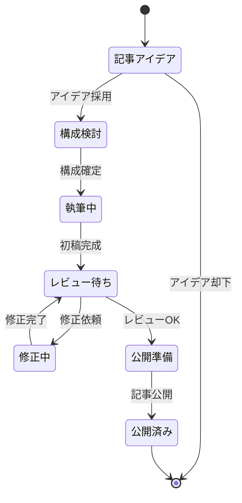

# ゴール
- キメレルの成果を上げるための改善策が考えられている
## 背景
- キメレルの競合が増えてきており、成果を出せないことによって炎上する案件が増えてきた
# 各ステップ
1. 10KWを調査し、よさげな機能をまとめる
2. 野中さんに朝に前日のタスク報告、ディスカッションを行い、当日のタスクを決める
3. ここからは決まっていないので固めたいところ
4. 野中さんから今後の施策の見通しを立てる
# 意識すること
- 競合だけが持っている/競合も持っていない、かつユーザーが求めている機能を探す
# これからやること
- 得られた知見やノウハウを生かしたいが、散らばってしまっていてうまくため込めていない
- PJTの全体像の見通しが甘く整理したい
- 調査内容に関しても、いったんかなり調査をしたので、方向性を見直す意味でも情報の整理に当てたい
- これをうまくobsidianを用いて行うことで、AIにインプットできるような形にしたい⇒AIをうまく活用して、能力を拡張させたい
# 作業ページ一覧
| ページ名                                                 | 概要                     |
| ---------------------------------------------------- | ---------------------- |
| [[気づき・所感]]                                              | 各作業の改善点を記載する           |
| [[04-15]]                                              | 各作業で浮かんだ疑問点を記載する       |
| [[反省点]]                                              | 野中さんとのMTGで出てきた反省点を記載する |
| https://gemini.google.com/app/29ebafcd67455ee9?hl=ja | geminiの壁打ちチャット         |
| https://x.gd/HDsQQ                                   | 作業用スプシ                 |
| [[調査内容整理]]                                           | うまく調査内容を整理するために使用するページ |

